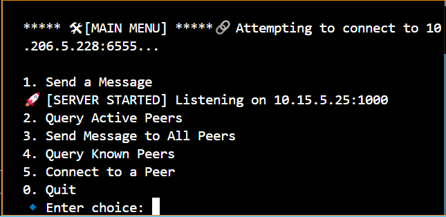
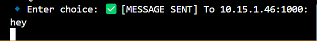
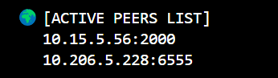
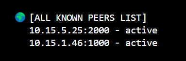
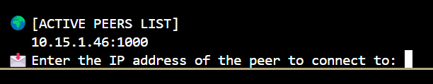
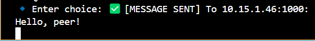

# The-Blocksmiths
# P2P Chat Program - Team: The Blocksmiths

## Team Members:
- **Gayathri Manaswini K** - Roll Number: **230001038**
- **K Brahmisree** - Roll Number: **230001035**
- **Raunak Anand** - Roll Number: **230001067**

---

## About This Project:
This is a Python-based Peer-to-Peer (P2P) chat application that allows direct communication between peers over a network. It enables users to send messages, query active peers, connect with known peers, and maintain a peer list.

##TCP:
TCP (Transmission Control Protocol) is a connection-oriented protocol, meaning a connection must be established between the client and server before any data transmission occurs.
Importance of client.connect()
In a TCP-based communication setup, the client cannot send messages unless it first establishes a connection with the server. This is achieved using the client.connect() function. That is connection is automatically made when we intend to send a message.

---

## Features:
✔️ **Real-time messaging** between multiple peers  
✔️ **Automatic peer tracking** – stores peers from whom messages were received  
✔️ **Reconnect feature** – connect back to active peers (Bonus implemented)  
✔️ **User-friendly interface** with a simple menu-based system  
✔️ **Peer status management** – tracks active and inactive peers  
✔️ **Message broadcasting** – send messages to all known peers  
✔️ **Mandatory peer connection** – connects to predefined peers at startup  
✔️ **Graceful exit** – notifies peers before disconnecting  

---

## Screenshots

## Screenshots

### Main Menu


### Message Sent


### Active Peers List


### Known Peers List


### Connection Request


### Connection Established


### Exit Confirmation


---

## How to Set Up and Run:
First, download the project files from GitHub:


git clone https://github.com/BRAHMISREE/THE_BLOCKSMITHS.git
cd THE_BLOCKSMITHS

### Clone the Repository
First, download the project files from GitHub:

```bash
git clone https://github.com/BRAHMISREE/The-Blocksmiths.git
cd The-Blocksmiths
